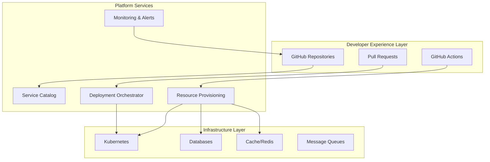

# Platform Engineering & Internal Developer Platforms

<Tip>
**TL;DR**: Platform Engineering reduces cognitive load by providing self-service infrastructure, standardized tooling, and golden paths. This guide shows how to build an IDP using GitHub as the central UI layer.
</Tip>

## Introduction

As engineering organizations scale, cognitive load becomes a critical bottleneck. Developers juggling multiple services, deployment pipelines, monitoring tools, and infrastructure concerns spend less time on feature development and more on operational overhead.

**Platform Engineering** addresses this by building **Internal Developer Platforms (IDPs)** that abstract complexity, provide self-service capabilities, and establish "golden paths" for common workflows.

---

## Cognitive Load Management

### Types of Cognitive Load

| Type | Description | Mitigation Strategy |
|------|-------------|---------------------|
| **Intrinsic** | Complexity inherent to the problem | Break down complex systems, provide abstractions |
| **Extraneous** | Unnecessary complexity from tools/processes | Standardize tooling, eliminate toil |
| **Germane** | Learning required for growth | Provide documentation, training, examples |

### Measuring Cognitive Load

```sql
-- Cognitive Load Survey Metrics
SELECT 
  team_name,
  AVG(time_to_first_deploy) as avg_deploy_time_hours,
  AVG(tools_count) as avg_tools_used,
  AVG(context_switches_per_day) as avg_context_switches,
  AVG(documentation_quality_score) as docs_score,
  AVG(self_service_capability_score) as self_service_score,
  -- Cognitive Load Index (0-100, lower is better)
  ROUND(
    (AVG(time_to_first_deploy) / 24 * 20) +
    (AVG(tools_count) * 5) +
    (AVG(context_switches_per_day) * 3) +
    ((5 - AVG(documentation_quality_score)) * 10) +
    ((5 - AVG(self_service_capability_score)) * 10),
  2) as cognitive_load_index
FROM developer_surveys
WHERE survey_date >= NOW() - INTERVAL '90 days'
GROUP BY team_name
ORDER BY cognitive_load_index DESC;
```

---

## Building an IDP with GitHub as the UI

### Architecture Overview



### Service Catalog Implementation

```yaml
# .github/service-catalog.yml
apiVersion: backstage.io/v1alpha1
kind: Component
metadata:
  name: payment-service
  description: Payment processing service
  annotations:
    github.com/project-slug: org/payment-service
    backstage.io/techdocs-ref: dir:../docs
spec:
  type: service
  lifecycle: production
  owner: payments-team
  system: payment-system
  providesApis:
    - payment-api
  dependsOn:
    - postgresql-prod
    - redis-cache
  tags:
    - tier-1
    - pci-compliant
    - customer-facing
```

### Self-Service Repository Creation

```yaml
# .github/workflows/create-service.yml
name: Create New Service

on:
  workflow_dispatch:
    inputs:
      service_name:
        description: 'Service name (kebab-case)'
        required: true
        type: string
      service_type:
        description: 'Service type'
        required: true
        type: choice
        options:
          - api-service
          - worker
          - library
          - frontend-app
      team:
        description: 'Owning team'
        required: true
        type: choice
        options:
          - platform
          - payments
          - analytics
          - frontend
      database:
        description: 'Database requirement'
        required: false
        type: boolean
        default: false
      cache:
        description: 'Redis cache requirement'
        required: false
        type: boolean
        default: false

jobs:
  create-repository:
    runs-on: ubuntu-latest
    outputs:
      repo_url: ${{ steps.create.outputs.repo_url }}
    steps:
      - uses: actions/checkout@v4
      
      - name: Create Repository
        id: create
        run: |
          REPO_URL=$(gh repo create "org/${{ github.event.inputs.service_name }}" \
            --template "org/template-${{ github.event.inputs.service_type }}" \
            --private \
            --description "Service owned by ${{ github.event.inputs.team }} team")
          echo "repo_url=$REPO_URL" >> $GITHUB_OUTPUT
      
      - name: Initialize Service Catalog Entry
        run: |
          cat > catalog-info.yaml <<EOF
          apiVersion: backstage.io/v1alpha1
          kind: Component
          metadata:
            name: ${{ github.event.inputs.service_name }}
            description: "Auto-generated ${{ github.event.inputs.service_type }}"
          spec:
            type: ${{ github.event.inputs.service_type }}
            lifecycle: development
            owner: ${{ github.event.inputs.team }}-team
          EOF
          
          git add catalog-info.yaml
          git commit -m "Add service catalog entry"
          git push

  provision-infrastructure:
    needs: create-repository
    if: github.event.inputs.database == 'true' || github.event.inputs.cache == 'true'
    runs-on: ubuntu-latest
    steps:
      - name: Provision Database
        if: github.event.inputs.database == 'true'
        run: |
          # Call internal provisioning API
          curl -X POST https://platform-api.internal/databases \
            -H "Authorization: Bearer $PLATFORM_TOKEN" \
            -d '{
              "name": "${{ github.event.inputs.service_name }}-db",
              "engine": "postgresql",
              "tier": "standard",
              "owner": "${{ github.event.inputs.team }}"
            }'
      
      - name: Provision Cache
        if: github.event.inputs.cache == 'true'
        run: |
          curl -X POST https://platform-api.internal/caches \
            -H "Authorization: Bearer $PLATFORM_TOKEN" \
            -d '{
              "name": "${{ github.event.inputs.service_name }}-cache",
              "engine": "redis",
              "tier": "small"
            }'
      
      - name: Update Repository with Credentials
        run: |
          # Store credentials as GitHub Secrets (via OIDC)
          gh secret set DB_HOST --body "$(curl ...)" --repo "org/${{ github.event.inputs.service_name }}"
          gh secret set DB_PASSWORD --body "$(curl ...)" --repo "org/${{ github.event.inputs.service_name }}"

  setup-ci-cd:
    needs: create-repository
    runs-on: ubuntu-latest
    steps:
      - uses: actions/checkout@v4
        repository: "org/${{ github.event.inputs.service_name }}"
      
      - name: Configure CI/CD Pipeline
        run: |
          mkdir -p .github/workflows
          cp ../templates/ci-template.yml .github/workflows/ci.yml
          cp ../templates/cd-template.yml .github/workflows/cd.yml
          
          git add .github/workflows/
          git commit -m "Configure CI/CD pipelines"
          git push
```

---

## Golden Path Templates

### API Service Template

```yaml
# templates/api-service/.github/workflows/ci.yml
name: API Service CI

on:
  push:
    branches: [main, develop]
  pull_request:
    branches: [main]

env:
  NODE_VERSION: '20'

jobs:
  validate:
    uses: org/platform-workflows/.github/workflows/validate.yml@main
    with:
      node-version: ${{ env.NODE_VERSION }}

  test:
    uses: org/platform-workflows/.github/workflows/test.yml@main
    needs: validate
    with:
      node-version: ${{ env.NODE_VERSION }}
      shard-count: 4

  build:
    uses: org/platform-workflows/.github/workflows/build.yml@main
    needs: test
    with:
      node-version: ${{ env.NODE_VERSION }}

  security-scan:
    uses: org/platform-workflows/.github/workflows/security.yml@main
    needs: build

  deploy-staging:
    uses: org/platform-workflows/.github/workflows/deploy.yml@main
    needs: [build, security-scan]
    with:
      environment: staging
      image-name: ghcr.io/org/${{ github.event.repository.name }}
```

### Worker Service Template

```yaml
# templates/worker-service/docker-compose.yml
version: '3.8'

services:
  worker:
    build: .
    environment:
      - DATABASE_URL=${DATABASE_URL}
      - REDIS_URL=${REDIS_URL}
      - QUEUE_NAME=${QUEUE_NAME:-default}
    depends_on:
      - postgres
      - redis
  
  postgres:
    image: postgres:15-alpine
    environment:
      POSTGRES_DB: worker_db
      POSTGRES_USER: worker
      POSTGRES_PASSWORD: password
    volumes:
      - postgres_data:/var/lib/postgresql/data
  
  redis:
    image: redis:7-alpine
    volumes:
      - redis_data:/data

volumes:
  postgres_data:
  redis_data:
```

---

## Platform Metrics Dashboard

### Key Platform Metrics

```sql
-- Platform Health Dashboard
SELECT 
  metric_name,
  metric_value,
  target_value,
  CASE 
    WHEN metric_value >= target_value THEN '✅'
    ELSE '⚠️'
  END as status
FROM (
  -- Developer Satisfaction
  SELECT 
    'Developer Satisfaction Score' as metric_name,
    AVG(satisfaction_score) as metric_value,
    4.0 as target_value
  FROM developer_surveys
  WHERE survey_date >= NOW() - INTERVAL '30 days'
  
  UNION ALL
  
  -- Time to First Deploy
  SELECT 
    'Avg Time to First Deploy (hours)' as metric_name,
    AVG(EXTRACT(EPOCH FROM (first_deploy_at - repo_created_at))/3600) as metric_value,
    24.0 as target_value
  FROM repository_metrics
  WHERE created_at >= NOW() - INTERVAL '90 days'
  
  UNION ALL
  
  -- Self-Service Adoption
  SELECT 
    'Self-Service Provisioning Rate (%)' as metric_name,
    COUNT(CASE WHEN provisioned_via = 'self-service' THEN 1 END)::float / 
      COUNT(*) * 100 as metric_value,
    80.0 as target_value
  FROM resource_provisioning_events
  WHERE created_at >= NOW() - INTERVAL '30 days'
  
  UNION ALL
  
  -- Platform Uptime
  SELECT 
    'Platform API Uptime (%)' as metric_name,
    uptime_percentage as metric_value,
    99.9 as target_value
  FROM platform_uptime_metrics
  WHERE period = CURRENT_MONTH
  
  UNION ALL
  
  -- Cognitive Load Index
  SELECT 
    'Average Cognitive Load Index' as metric_name,
    AVG(cognitive_load_index) as metric_value,
    30.0 as target_value  -- Lower is better
  FROM team_cognitive_load_scores
  WHERE measured_at >= NOW() - INTERVAL '30 days'
) metrics;
```

---

## Implementation Roadmap

### Phase 1: Foundation (Months 1-2)
- [ ] Audit current cognitive load pain points
- [ ] Create 3-5 golden path templates
- [ ] Implement basic service catalog
- [ ] Set up self-service repository creation

### Phase 2: Automation (Months 3-4)
- [ ] Build resource provisioning API
- [ ] Integrate infrastructure-as-code templates
- [ ] Implement automated CI/CD setup
- [ ] Create platform metrics dashboard

### Phase 3: Enhancement (Months 5-6)
- [ ] Add advanced self-service capabilities
- [ ] Implement cost attribution per service
- [ ] Build developer portal UI
- [ ] Establish platform SLAs

### Phase 4: Optimization (Ongoing)
- [ ] Monthly cognitive load surveys
- [ ] Quarterly template updates
- [ ] Continuous platform performance monitoring
- [ ] Regular developer feedback sessions

---

<Success>
**Elite Practice**: The best platform teams measure their success by developer adoption and satisfaction, not by the number of features built. If developers aren't using your golden paths, investigate why.
</Success>

---

## Related Resources

- [Backstage Project](https://backstage.io/)
- [Internal Developer Platforms (O'Reilly)](https://www.oreilly.com/library/view/internal-developer-platforms/9781098136819/)
- [Platform Engineering on GitHub](https://github.com/topics/platform-engineering)
- [Cognitive Load in Software Development](https://martinfowler.com/bliki/CognitiveLoad.html)
