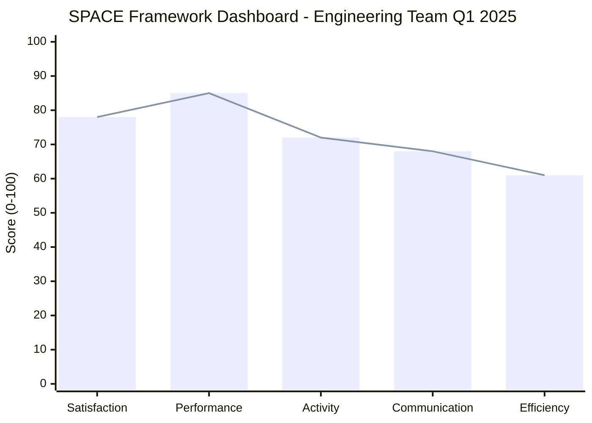

# The SPACE Framework: Measuring Developer Productivity Holistically

<Tip>
**TL;DR**: The SPACE framework (Satisfaction, Performance, Activity, Communication, Efficiency) provides a holistic view of developer productivity beyond DORA metrics. This guide shows how to measure each dimension with GitHub data, surveys, and telemetry.
</Tip>

## Introduction

While DORA metrics revolutionized how we measure software delivery, they tell only part of the story. The **SPACE Framework**, developed through research at Microsoft and University of Victoria, provides a multi-dimensional view of developer productivity that captures what DORA misses: developer satisfaction, collaboration quality, and flow state.

For teams of 50+ engineers, understanding these dimensions is critical for:
- Identifying burnout before it happens
- Optimizing for sustainable pace, not just speed
- Measuring the impact of DX initiatives
- Making data-driven decisions about tooling and processes

---

## The SPACE Framework Dimensions

### Overview

| Dimension | What It Measures | Why It Matters |
|-----------|------------------|----------------|
| **S**atisfaction | Developer well-being, fulfillment | Predicts retention, quality, innovation |
| **P**erformance | Outcome quality, reliability | Direct business impact |
| **A**ctivity | Volume of work outputs | Capacity planning, trend analysis |
| **C**ommunication | Collaboration, knowledge sharing | Team effectiveness, onboarding |
| **E**fficiency | Flow state, uninterrupted work | Speed with sustainability |

---

## Measuring Satisfaction & Well-being

### Survey-Based Metrics

```yaml
# Quarterly Developer Satisfaction Survey
questions:
  - question: "How satisfied are you with your current development tools?"
    scale: 1-5
    category: satisfaction
    
  - question: "How often do you experience flow state during your work?"
    scale: Never-Daily
    category: efficiency
    
  - question: "Rate your work-life balance over the past month"
    scale: 1-5
    category: satisfaction
    
  - question: "How supported do you feel by your team?"
    scale: 1-5
    category: communication
    
  - question: "How much time do you spend on meaningful vs. tedious work?"
    format: percentage split
    category: efficiency
```

### GitHub Data Indicators

```sql
-- GitHub Audit Log Query: Detecting Burnout Signals
-- Run monthly to identify at-risk developers

SELECT 
  actor_login,
  COUNT(*) as total_actions,
  COUNT(DISTINCT DATE(created_at)) as active_days,
  AVG(EXTRACT(HOUR FROM created_at)) as avg_hour_of_day,
  COUNT(CASE WHEN EXTRACT(HOUR FROM created_at) BETWEEN 22 AND 6 THEN 1 END) as late_night_actions,
  COUNT(CASE WHEN EXTRACT(DOW FROM created_at) IN (0, 6) THEN 1 END) as weekend_actions
FROM github_audit_log
WHERE created_at >= NOW() - INTERVAL '30 days'
GROUP BY actor_login
HAVING 
  COUNT(DISTINCT DATE(created_at)) > 25  -- Working most days
  AND (
    COUNT(CASE WHEN EXTRACT(HOUR FROM created_at) BETWEEN 22 AND 6 THEN 1 END) > 20
    OR COUNT(CASE WHEN EXTRACT(DOW FROM created_at) IN (0, 6) THEN 1 END) > 8
  )
ORDER BY total_actions DESC;
```

### Satisfaction Dashboard Metrics

```javascript
// Example: Calculating Developer Satisfaction Score
function calculateSatisfactionScore(developer) {
  const weights = {
    surveyScore: 0.4,
    prReviewTime: 0.2,
    workLifeBalance: 0.2,
    flowStateFrequency: 0.2
  };
  
  const normalizedSurvey = developer.surveyScore / 5; // Normalize to 0-1
  const normalizedReviewTime = Math.max(0, 1 - (developer.avgReviewTimeHours / 24));
  const normalizedWorkLife = developer.workingWeekendDays / 8; // Lower is better
  const normalizedFlow = developer.flowStateDays / 20; // Working days in month
  
  return (
    normalizedSurvey * weights.surveyScore +
    normalizedReviewTime * weights.prReviewTime +
    (1 - normalizedWorkLife) * weights.workLifeBalance +
    normalizedFlow * weights.flowStateFrequency
  );
}
```

---

## Measuring Performance (Outcomes)

### Quality Metrics from GitHub

```sql
-- PR Quality Score Calculation
WITH pr_stats AS (
  SELECT 
    author_login,
    COUNT(*) as total_prs,
    AVG(additions + deletions) as avg_lines_changed,
    AVG(comments_count) as avg_review_comments,
    AVG(EXTRACT(EPOCH FROM (merged_at - created_at))/3600) as avg_time_to_merge,
    COUNT(CASE WHEN merged_at IS NULL THEN 1 END)::float / COUNT(*) as merge_rate,
    COUNT(CASE WHEN commits_pushed_after_first_review > 0 THEN 1 END)::float / COUNT(*) as revision_rate
  FROM github_pull_requests
  WHERE created_at >= NOW() - INTERVAL '90 days'
  GROUP BY author_login
)
SELECT 
  author_login,
  -- Performance Score (0-100)
  ROUND(
    (merge_rate * 30) +  -- 30 points for merge rate
    (GREATEST(0, 1 - revision_rate) * 25) +  -- 25 points for fewer revisions
    (GREATEST(0, 1 - (avg_time_to_merge / 72)) * 25) +  -- 25 points for faster merges
    (GREATEST(0, 1 - (avg_review_comments / 20)) * 20)  -- 20 points for fewer review comments
  , 2) as performance_score
FROM pr_stats
ORDER BY performance_score DESC;
```

### Production Incident Correlation

```sql
-- Correlate PRs with Production Incidents
SELECT 
  pr.author_login,
  COUNT(DISTINCT pr.number) as total_prs,
  COUNT(DISTINCT incident.id) as related_incidents,
  ROUND(COUNT(DISTINCT incident.id)::float / COUNT(DISTINCT pr.number) * 100, 2) as incident_rate
FROM github_pull_requests pr
LEFT JOIN production_incidents incident ON 
  incident.root_cause_commit_sha = pr.merge_commit_sha
  AND incident.created_at BETWEEN pr.merged_at AND pr.merged_at + INTERVAL '7 days'
WHERE pr.merged_at >= NOW() - INTERVAL '90 days'
GROUP BY pr.author_login
HAVING COUNT(DISTINCT pr.number) >= 5  -- Minimum PR threshold
ORDER BY incident_rate DESC;
```

---

## Measuring Activity (Output Volume)

### Meaningful Activity Metrics

```sql
-- Developer Activity Dashboard (Last 30 Days)
SELECT 
  actor_login as developer,
  COUNT(DISTINCT DATE(created_at)) as days_active,
  COUNT(DISTINCT pull_request_number) as prs_created,
  COUNT(DISTINCT CASE WHEN action = 'pull_request.reviewed' THEN id END) as prs_reviewed,
  SUM(CASE WHEN action = 'push' THEN 1 ELSE 0 END) as pushes,
  SUM(CASE WHEN action = 'pull_request.merged' THEN 1 ELSE 0 END) as prs_merged,
  COUNT(DISTINCT issue_number) as issues_addressed,
  COUNT(DISTINCT repository_name) as repos_touched
FROM github_audit_log
WHERE created_at >= NOW() - INTERVAL '30 days'
  AND action IN ('push', 'pull_request.created', 'pull_request.merged', 'pull_request.reviewed', 'issues.closed')
GROUP BY actor_login
ORDER BY days_active DESC;
```

### Activity Trends Over Time

```sql
-- Weekly Activity Trends (Last 12 Weeks)
SELECT 
  DATE_TRUNC('week', created_at) as week_start,
  actor_login,
  COUNT(*) as actions,
  COUNT(DISTINCT pull_request_number) as prs,
  COUNT(DISTINCT CASE WHEN action = 'pull_request.reviewed' THEN id END) as reviews
FROM github_audit_log
WHERE created_at >= NOW() - INTERVAL '12 weeks'
GROUP BY DATE_TRUNC('week', created_at), actor_login
ORDER BY week_start, actor_login;
```

<Warning>
**Caution**: Activity metrics should NEVER be used for individual performance evaluation. They're for capacity planning, trend analysis, and identifying bottlenecks only.
</Warning>

---

## Measuring Communication & Collaboration

### Code Review Network Analysis

```sql
-- Review Collaboration Matrix
SELECT 
  pr.author_login as author,
  review.user_login as reviewer,
  COUNT(*) as reviews_between,
  AVG(EXTRACT(EPOCH FROM (review.submitted_at - pr.created_at))/3600) as avg_review_time_hours
FROM github_pull_requests pr
JOIN github_pull_request_reviews review ON pr.id = review.pull_request_id
WHERE pr.created_at >= NOW() - INTERVAL '90 days'
GROUP BY pr.author_login, review.user_login
HAVING COUNT(*) >= 3
ORDER BY reviews_between DESC;
```

### Knowledge Distribution Metrics

```sql
-- File Ownership Concentration
WITH file_authors AS (
  SELECT 
    repository_name,
    file_path,
    author_login,
    COUNT(*) as commits_to_file
  FROM github_commits
  WHERE committed_date >= NOW() - INTERVAL '90 days'
  GROUP BY repository_name, file_path, author_login
),
file_ownership AS (
  SELECT 
    repository_name,
    file_path,
    MAX(commits_to_file) as max_commits,
    SUM(commits_to_file) as total_commits
  FROM file_authors
  GROUP BY repository_name, file_path
)
SELECT 
  repository_name,
  ROUND(AVG(max_commits::float / total_commits) * 100, 2) as ownership_concentration_pct,
  COUNT(CASE WHEN max_commits::float / total_commits > 0.8 THEN 1 END) as bus_factor_risk_files
FROM file_ownership
GROUP BY repository_name
ORDER BY ownership_concentration_pct DESC;
```

### Cross-Team Collaboration Index

```sql
-- Cross-Team Collaboration Score
SELECT 
  team_a.name as team_a,
  team_b.name as team_b,
  COUNT(DISTINCT pr.number) as cross_team_prs,
  COUNT(DISTINCT pr.author_login) as unique_collaborators,
  ROUND(COUNT(DISTINCT pr.number)::float / 30, 2) as cross_team_prs_per_day
FROM github_pull_requests pr
JOIN team_memberships tm_author ON pr.author_login = tm_author.user_login
JOIN team_memberships tm_reviewer ON pr.reviewer_login = tm_reviewer.user_login
JOIN teams team_a ON tm_author.team_id = team_a.id
JOIN teams team_b ON tm_reviewer.team_id = team_b.id
WHERE team_a.id != team_b.id
  AND pr.created_at >= NOW() - INTERVAL '30 days'
GROUP BY team_a.name, team_b.name
ORDER BY cross_team_prs DESC;
```

---

## Measuring Efficiency & Flow State

### Calculating Flow Time

```sql
-- Developer Flow Time Analysis
WITH developer_sessions AS (
  SELECT 
    actor_login,
    DATE(created_at) as session_date,
    MIN(created_at) as session_start,
    MAX(created_at) as session_end,
    COUNT(*) as actions_in_session,
    EXTRACT(EPOCH FROM (MAX(created_at) - MIN(created_at)))/60 as session_duration_minutes
  FROM github_audit_log
  WHERE created_at >= NOW() - INTERVAL '30 days'
    AND action IN ('push', 'pull_request.created', 'pull_request.updated')
  GROUP BY actor_login, DATE(created_at)
  HAVING COUNT(*) >= 3  -- Minimum actions to qualify as focused session
),
flow_sessions AS (
  SELECT 
    actor_login,
    session_date,
    session_duration_minutes,
    CASE 
      WHEN session_duration_minutes >= 90 THEN true  -- 90+ min = deep flow
      WHEN session_duration_minutes >= 45 THEN true  -- 45+ min = moderate flow
      ELSE false
    END as is_flow_state
  FROM developer_sessions
)
SELECT 
  actor_login,
  COUNT(*) as total_sessions,
  SUM(CASE WHEN is_flow_state THEN 1 ELSE 0 END) as flow_sessions,
  ROUND(SUM(CASE WHEN is_flow_state THEN 1 ELSE 0 END)::float / COUNT(*) * 100, 2) as flow_percentage,
  ROUND(AVG(CASE WHEN is_flow_state THEN session_duration_minutes END), 2) as avg_flow_duration_minutes
FROM flow_sessions
GROUP BY actor_login
HAVING COUNT(*) >= 10  -- Minimum sessions for statistical significance
ORDER BY flow_percentage DESC;
```

### Interruption Analysis

```sql
-- Context Switching Detection
WITH hourly_activity AS (
  SELECT 
    actor_login,
    DATE_TRUNC('hour', created_at) as hour,
    COUNT(DISTINCT repository_name) as repos_touched,
    COUNT(DISTINCT pull_request_number) as prs_touched,
    COUNT(DISTINCT action_type) as action_types
  FROM github_audit_log
  WHERE created_at >= NOW() - INTERVAL '7 days'
  GROUP BY actor_login, DATE_TRUNC('hour', created_at)
)
SELECT 
  actor_login,
  ROUND(AVG(repos_touched), 2) as avg_repos_per_hour,
  ROUND(AVG(prs_touched), 2) as avg_prs_per_hour,
  ROUND(AVG(action_types), 2) as avg_action_types_per_hour,
  COUNT(CASE WHEN repos_touched > 3 OR prs_touched > 5 THEN 1 END) as high_context_switch_hours
FROM hourly_activity
GROUP BY actor_login
ORDER BY high_context_switch_hours DESC;
```

### Toil Detection

```sql
-- Automated Toil Identification
WITH repetitive_tasks AS (
  SELECT 
    actor_login,
    action,
    repository_name,
    DATE_TRUNC('day', created_at) as day,
    COUNT(*) as occurrences
  FROM github_audit_log
  WHERE created_at >= NOW() - INTERVAL '30 days'
    AND action IN (
      'workflow_run.completed',
      'check_run.completed',
      'deployment_status.created',
      'release.published'
    )
  GROUP BY actor_login, action, repository_name, DATE_TRUNC('day', created_at)
)
SELECT 
  actor_login,
  action,
  SUM(occurrences) as total_occurrences,
  COUNT(DISTINCT day) as days_with_action,
  ROUND(SUM(occurrences)::float / COUNT(DISTINCT day), 2) as avg_daily_occurrences,
  ROUND(SUM(occurrences) * 5 / 60.0, 2) as estimated_minutes_spent  -- Assume 5 min per occurrence
FROM repetitive_tasks
GROUP BY actor_login, action
HAVING SUM(occurrences) > 20  -- Significant repetition
ORDER BY estimated_minutes_spent DESC;
```

---

## SPACE Dashboard Implementation

### Composite SPACE Score

```javascript
// Calculate Overall SPACE Score for Team/Organization
function calculateSpaceScore(metrics) {
  const dimensions = {
    satisfaction: {
      weight: 0.25,
      score: (
        metrics.surveySatisfaction * 0.4 +
        metrics.workLifeBalanceScore * 0.3 +
        metrics.flowStateFrequency * 0.3
      )
    },
    performance: {
      weight: 0.25,
      score: (
        metrics.prMergeRate * 0.3 +
        metrics.productionQualityScore * 0.4 +
        metrics.reviewQualityScore * 0.3
      )
    },
    activity: {
      weight: 0.15,
      score: (
        metrics.consistentActivityScore * 0.5 +
        metrics.sustainablePaceScore * 0.5
      )
    },
    communication: {
      weight: 0.20,
      score: (
        metrics.reviewCollaborationScore * 0.4 +
        metrics.knowledgeDistributionScore * 0.3 +
        metrics.crossTeamCollaborationScore * 0.3
      )
    },
    efficiency: {
      weight: 0.15,
      score: (
        metrics.flowTimePercentage * 0.5 +
        metrics.lowContextSwitchingScore * 0.3 +
        metrics.lowToilScore * 0.2
      )
    }
  };
  
  const weightedSum = Object.values(dimensions).reduce(
    (sum, dim) => sum + (dim.score * dim.weight),
    0
  );
  
  return {
    overall: Math.round(weightedSum * 100),
    dimensions: Object.fromEntries(
      Object.entries(dimensions).map(([key, dim]) => [key, Math.round(dim.score * 100)])
    )
  };
}
```

### Visualization Recommendations



---

## Implementation Roadmap

### Month 1: Foundation
- [ ] Set up GitHub audit log export to data warehouse
- [ ] Create baseline satisfaction survey
- [ ] Build initial SPACE metrics dashboard
- [ ] Establish privacy guidelines and data governance

### Month 2: Integration
- [ ] Integrate survey data with GitHub metrics
- [ ] Implement automated weekly SPACE reports
- [ ] Train engineering managers on interpreting metrics
- [ ] Create intervention playbooks for low scores

### Month 3: Optimization
- [ ] A/B test DX improvements using SPACE metrics
- [ ] Establish SPACE benchmarks by team type
- [ ] Integrate with sprint planning and retrospectives
- [ ] Automate toil detection and reduction recommendations

### Ongoing: Continuous Improvement
- [ ] Quarterly survey refinement based on feedback
- [ ] Monthly SPACE metric review with leadership
- [ ] Bi-weekly team-level SPACE discussions
- [ ] Annual benchmark against industry standards

---

<Success>
**Elite Practice**: Use SPACE metrics to identify systemic issues, not to evaluate individuals. When satisfaction drops, investigate processes and tools—not people.
</Success>

<Warning>
**Ethical Consideration**: Always communicate transparently about what metrics are collected and why. Never use SPACE data for performance reviews or compensation decisions.
</Warning>

---

## Related Resources

- [SPACE Framework Research Paper](https://dl.acm.org/doi/10.1145/3468264.3468594)
- [GitHub Insights API](https://docs.github.com/en/rest/metrics)
- [Developer Experience Measurement Guide](https://www.atlassian.com/engineering/measuring-developer-productivity)
- [DORA + SPACE Integration Patterns](https://cloud.google.com/blog/products/devops-sre/using-the-space-framework-to-measure-developer-productivity)
